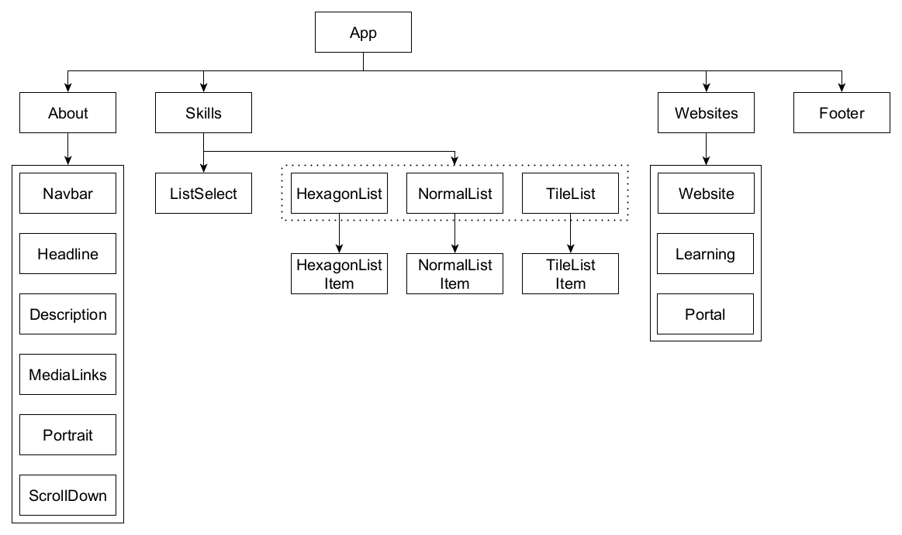

# Leon's portfolio

Creating web applications has been my passion for three years. I love learning about new technologies, and I am always looking for new challenges.

That is why I wanted to create a portfolio website for presenting myself and my current skills in the areas of web design and development.

# Installation

Run the following command to install all needed dependencies:

```bash
npm i
```

To start the application in development mode, execute the following command:

```bash
npm start
```

The application will then be available at http://localhost:5173.

# Technical background

This project uses [SvelteKit](https://kit.svelte.dev/) as a framework on top of the [Svelte](https://svelte.dev/) compiler. In addition to that, it uses [Tailwind CSS](https://tailwindcss.com/) for styling with [daisyUI](https://daisyui.com/) as a component library. Last but not least, [TypeScript](https://www.typescriptlang.org/) is used for type checking.

## Svelte

[Svelte](https://svelte.dev/) is a modern, component-based JavaScript framework for building web applications that compiles code at build time to highly efficient, low-level JavaScript code that updates the DOM with minimal overhead during runtime.

Furthermore, Svelte's component-based syntax is simple and easy to learn, and its code is typically more concise than other frameworks, making it easier to write and maintain.

## SvelteKit

[SvelteKit](https://kit.svelte.dev/) is a framework built on top of the Svelte compiler that provides additional functionality for building web applications, such as server-side rendering, routing, and building for different platforms.

## Tailwind CSS

[Tailwind CSS](https://tailwindcss.com/) is a so called utility-first CSS framework. This means that it does not provide classes for specific components, but rather provides classes with short names for singular CSS properties and therefore a shorter way of writing CSS.

## daisyUI

[daisyUI](https://daisyui.com/) is a free and open-source component library for Tailwind CSS that provides a set of accessible and customizable UI components, such as buttons, forms, cards, and more. It is designed to speed up the UI development process while maintaining consistency and accessibility.

## TypeScript

[TypeScript](https://www.typescriptlang.org/) is a superset of JavaScript that adds optional static type checking, interfaces, classes, and other features to help developers write more maintainable and scalable code by catching errors before runtime and providing better tooling support.

# Architecture

The following shows a component diagram of all used components in this project:



## Legend

-   Rectangle: Component / multiple components
-   Arrow with normal line: Above component contains component below
-   Arrow with dotted line: Above component can contain component below
-   Dotted rectangle: Above component contains one of the components concluded in the dotted rectangle
